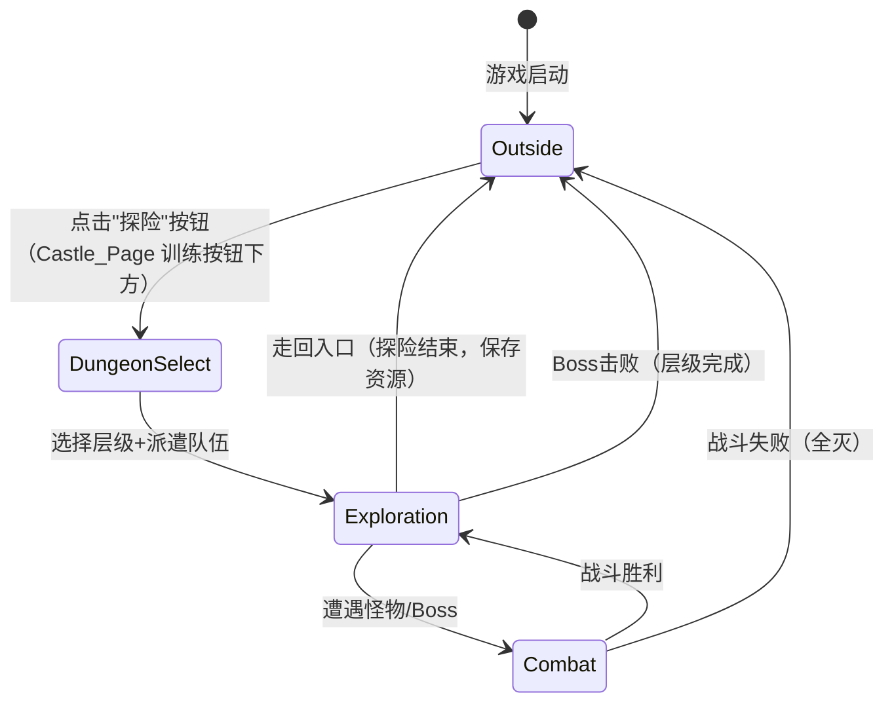

# 设计文档：关内地牢探险系统（InsideThePass）

## 概述

关内地牢探险系统是 Underground Castle 的核心玩法之一。玩家从关外派遣冒险者进入地牢，在 50x50 的网格地图上探索，使用迷雾战争（Fog of War）机制逐步点亮地图。地牢入口位于地图正中心，玩家通过上下左右移动探索未知区域，遭遇怪物触发回合制战斗，收集宝藏获取资源，击败 Boss 解锁下一层。已点亮的地图进度可持久化保存。

系统沿用项目现有架构：单文件架构（index.html + script 标签）、配置外置（JS 文件全局变量）、2D Canvas 渲染、localStorage 持久化。

## 架构

```
index.html              — 主文件，Canvas + 游戏循环 + 关外/关内场景切换
outside-logic.js        — 关外经营核心逻辑（已有）
inside-logic.js         — 关内探险核心逻辑（新增）
dungeon-config.js       — 地牢配置（地图尺寸、视野、层级定义）
monster-config.js       — 怪物配置（类型、属性、掉落）
boss-config.js          — Boss 配置（属性、技能、奖励）
combat-config.js        — 战斗行为配置（技能效果、伤害公式参数）
outside-config.js       — 关外配置（已有）
job-config.js           — 岗位配置（已有）
resource-config.js      — 资源配置（已有）
soldier-config.js       — 士兵配置（已有）
```

### 场景切换架构



index.html 通过 `SceneManager` 管理当前场景（outside/dungeon-select/exploration/combat），游戏循环根据当前场景调用对应的 update 和 render 方法。

### 模块依赖

```
SceneManager → ExplorationManager / CombatEngine / DungeonSelectUI
ExplorationManager → DungeonMap / FogOfWar / EncounterGenerator
CombatEngine → CombatAction / StatusEffect
ProgressTracker → SaveSystem（复用关外存档机制，新增 dungeon 字段）
ConfigLoader → dungeon-config / monster-config / boss-config / combat-config
```

## 组件与接口

### SceneManager（场景管理器）
管理关外/关内场景切换，在 index.html 中集成。

```javascript
var SceneManager = {
    currentScene: 'outside',  // 'outside' | 'dungeon-select' | 'exploration' | 'combat'
    
    switchTo: function(scene, params) {},  // 切换场景，params 传递上下文
    update: function(timestamp, deltaTime) {},  // 当前场景更新
    render: function(ctx, canvas) {}  // 当前场景渲染
};
```

### DungeonMap（地牢地图）
管理 50x50 网格地图数据，包括地块类型和内容。

```javascript
var DungeonMap = {
    width: 50,
    height: 50,
    tiles: [],  // 二维数组 [y][x]，每个 tile: { type, content, explored }
    entrance: { x: 25, y: 25 },  // 入口位于正中心
    
    init: function(layerId, config) {},       // 根据配置初始化地图
    getTile: function(x, y) {},               // 获取指定坐标地块
    setExplored: function(x, y) {},           // 标记地块为已探索
    isInBounds: function(x, y) {},            // 边界检查
    getAdjacentTiles: function(x, y) {}       // 获取相邻地块
};
```

地块类型（tile.type）：
- `'empty'` — 空地，可通行
- `'wall'` — 墙壁，不可通行
- `'entrance'` — 入口
- `'boss'` — Boss 房间

地块内容（tile.content）：
- `null` — 无内容
- `{ type: 'monster', monsterId: string }` — 怪物遭遇
- `{ type: 'treasure', treasureId: string, items: [] }` — 宝藏
- `{ type: 'boss', bossId: string }` — Boss

### FogOfWar（迷雾战争）
管理视野和迷雾状态。

```javascript
var FogOfWar = {
    revealed: [],  // 二维布尔数组 [y][x]，true = 已点亮
    
    init: function(width, height) {},                    // 初始化全黑地图
    reveal: function(centerX, centerY, range) {},        // 点亮以 center 为中心的区域
    isRevealed: function(x, y) {},                       // 查询地块是否已点亮
    getRevealedState: function() {},                     // 获取完整迷雾状态（用于存档）
    loadRevealedState: function(state) {}                // 从存档恢复迷雾状态
};
```

视野规则：以玩家位置为中心，点亮周围 2 格范围内的所有地块（曼哈顿距离 ≤ 2 的正方形区域，即 5x5 区域）。

### ExplorationManager（探索管理器）
管理探索流程：移动、遭遇触发、宝藏收集。

```javascript
var ExplorationManager = {
    playerPos: { x: 25, y: 25 },
    party: [],           // 当前探险队伍（冒险者引用）
    currentLayer: 1,
    collectedResources: {},  // 本次探险累计资源
    
    init: function(layer, party, savedProgress) {},  // 初始化探索
    move: function(direction) {},      // direction: 'up'|'down'|'left'|'right'
    handleClick: function(clickX, clickY, canvasWidth, canvasHeight) {},  // 根据点击位置判定方向并移动
    collectTreasure: function() {},    // 收集当前位置宝藏
    getVisibleTiles: function() {},    // 获取当前视野内地块
    endExploration: function() {},     // 结束探索，汇总资源（玩家走回入口时触发）
    getProgress: function() {}         // 获取当前进度（用于存档）
};
```

方向判定规则：以 Canvas 中心为原点，计算 `dx = clickX - centerX`、`dy = clickY - centerY`。若 `|dx| > |dy|` 则为水平方向（dx > 0 右，dx < 0 左），否则为垂直方向（dy > 0 下，dy < 0 上）。

返回入口规则：玩家移动后若当前位置等于入口坐标（且不是刚进入地牢的初始状态），则触发 `endExploration()`，保存累计资源并切换回关外场景。

### CombatEngine（战斗引擎）
处理独立 CD 制战斗逻辑。

```javascript
var CombatEngine = {
    allies: [],           // 我方单位 [{ name, attack, speed, skills, attackCD, currentCD, statusEffects }]
    enemy: null,          // 敌方单位（单个）{ name, hp, maxHp, attack, speed, attackCD, currentCD }
    partyTotalHP: 0,      // 我方队伍总血量（所有士兵 hp 之和）
    partyMaxHP: 0,        // 我方队伍最大总血量
    combatLog: [],        // 战斗日志
    state: 'idle',        // 'idle' | 'active' | 'victory' | 'defeat'
    elapsedTime: 0,       // 战斗经过时间（秒）
    
    init: function(allies, enemy) {},                    // 初始化战斗，计算队伍总血量和各单位 CD
    update: function(deltaTime) {},                      // 更新战斗状态（减少 CD，触发攻击）
    executeAllyAttack: function(ally) {},                // 执行我方士兵攻击（释放技能 + 攻击敌人）
    executeEnemyAttack: function() {},                   // 执行敌人攻击（扣除队伍总血量）
    calculateDamage: function(attacker, isAlly) {},      // 伤害计算（基于攻击力）
    applyStatusEffect: function(target, effect) {},      // 施加状态效果（buff）
    updateStatusEffects: function(deltaTime) {},         // 更新状态效果持续时间
    checkBattleEnd: function() {},                       // 检查战斗是否结束
    getRewards: function() {}                            // 获取战斗奖励
};
```

**战斗机制说明：**
- **独立 CD 制**：每个士兵和敌人有独立的攻击 CD 计时器，`攻击CD = 10秒 / 速度`
- **并行攻击**：士兵 CD 到期立即攻击，互不等待，敌人同理
- **共享血量池**：我方队伍总血量 = 所有士兵 hp 之和，敌人攻击直接扣队伍总血量
- **技能自动释放**：士兵攻击时自动释放所有可用辅助技能（buff）
- **战斗结束**：队伍总血量 ≤ 0 失败，敌人血量 ≤ 0 胜利
- **敌方单位**：每场战斗敌方永远只有 1 个单位（怪物或 Boss）

### ProgressTracker（进度追踪器）
管理地牢解锁和完成状态。

```javascript
var ProgressTracker = {
    unlockedLayers: [1],     // 已解锁层级
    completedLayers: [],     // 已完成层级（Boss 已击败）
    layerProgress: {},       // 每层探索进度 { layerId: { fogState, bossDefeated } }
    bestRecords: {},         // 最佳记录 { layerId: { time, resourcesGained } }
    
    init: function(savedData) {},                // 从存档初始化
    isLayerUnlocked: function(layerId) {},       // 查询层级是否解锁
    unlockNextLayer: function(currentLayer) {},  // 解锁下一层
    markLayerComplete: function(layerId) {},     // 标记层级完成
    saveProgress: function() {},                 // 获取可序列化的进度数据
    getLayerProgress: function(layerId) {}       // 获取指定层的探索进度
};
```

### DungeonSelectUI（地牢选择界面）
派遣队伍和选择层级的 UI。

```javascript
var DungeonSelectUI = {
    selectedLayer: 1,
    selectedParty: [],
    maxPartySize: 4,
    
    render: function(ctx, canvas, progressTracker, soldierManager) {},
    handleClick: function(x, y) {},
    selectSoldier: function(soldierIndex) {},
    removeSoldier: function(partyIndex) {},
    startExploration: function() {}
};
```

### DungeonRenderer（地牢渲染器）
负责探索界面的 Canvas 渲染。

```javascript
var DungeonRenderer = {
    tileSize: 12,        // 每个地块像素大小（800/50=16，留边距用12）
    offsetX: 0,          // 地图渲染偏移（居中）
    offsetY: 0,
    
    render: function(ctx, canvas, dungeonMap, fogOfWar, playerPos, party) {},
    drawTile: function(ctx, x, y, tile, isRevealed, isVisible) {},
    drawPlayer: function(ctx, x, y) {},
    drawMinimap: function(ctx, canvas, dungeonMap, fogOfWar, playerPos) {},
    drawPartyStatus: function(ctx, canvas, party) {},
    drawResourceSummary: function(ctx, canvas, resources) {}
};
```

### CombatRenderer（战斗渲染器）
负责战斗界面的 Canvas 渲染。

```javascript
var CombatRenderer = {
    render: function(ctx, canvas, combatEngine) {},
    drawUnit: function(ctx, unit, x, y, isAlly) {},
    drawHealthBar: function(ctx, unit, x, y) {},
    drawActionMenu: function(ctx, canvas, unit) {},
    drawCombatLog: function(ctx, canvas, log) {},
    drawStatusEffects: function(ctx, unit, x, y) {}
};
```

### ConfigLoader（配置加载器）
统一加载所有关内配置。

```javascript
var ConfigLoader = {
    dungeonConfig: null,
    monsterConfig: null,
    bossConfig: null,
    combatConfig: null,
    
    loadAll: function() {},              // 加载所有配置
    getDungeonLayer: function(layerId) {},  // 获取层级配置
    getMonster: function(monsterId) {},     // 获取怪物配置
    getBoss: function(bossId) {},           // 获取 Boss 配置
    getSkill: function(skillId) {}          // 获取技能配置
};
```

## 数据模型

### 地牢配置格式（dungeon-config.js）

```javascript
var DUNGEON_CONFIG_EXTERNAL = {
    mapWidth: 50,
    mapHeight: 50,
    viewRange: 2,           // 视野范围（曼哈顿距离）
    maxPartySize: 4,        // 最大队伍人数
    entrance: { x: 25, y: 25 },  // 入口位置（正中心）
    
    layers: {
        1: {
            name: '废弃矿洞',
            wallDensity: 0.3,       // 墙壁密度
            monsterDensity: 0.05,   // 怪物密度
            treasureDensity: 0.02,  // 宝藏密度
            monsterPool: ['slime', 'bat', 'rat'],
            treasurePool: [
                { items: [{ resource: 'gold', min: 5, max: 15 }], weight: 5 },
                { items: [{ resource: 'iron', min: 1, max: 3 }], weight: 3 },
                { items: [{ resource: 'crystal', min: 1, max: 1 }], weight: 1 }
            ],
            bossId: 'goblin_king'
        },
        2: {
            name: '暗影地穴',
            wallDensity: 0.25,
            monsterDensity: 0.07,
            treasureDensity: 0.03,
            monsterPool: ['skeleton', 'ghost', 'spider'],
            treasurePool: [
                { items: [{ resource: 'gold', min: 10, max: 30 }], weight: 5 },
                { items: [{ resource: 'steel', min: 1, max: 2 }], weight: 3 },
                { items: [{ resource: 'rune', min: 1, max: 1 }], weight: 1 }
            ],
            bossId: 'shadow_lord'
        }
    }
};
```

### 怪物配置格式（monster-config.js）

```javascript
var MONSTER_CONFIG_EXTERNAL = {
    monsters: {
        slime: {
            name: '史莱姆',
            stats: { hp: 10, attack: 2, defense: 1, speed: 3 },
            skills: ['basic_attack'],
            rewards: { gold: { min: 1, max: 3 }, exp: 5 }
        },
        bat: {
            name: '蝙蝠',
            stats: { hp: 8, attack: 3, defense: 0, speed: 7 },
            skills: ['basic_attack'],
            rewards: { gold: { min: 1, max: 2 }, exp: 4 }
        },
        rat: {
            name: '巨鼠',
            stats: { hp: 12, attack: 3, defense: 2, speed: 4 },
            skills: ['basic_attack'],
            rewards: { gold: { min: 2, max: 4 }, exp: 6 }
        }
    }
};
```

### Boss 配置格式（boss-config.js）

```javascript
var BOSS_CONFIG_EXTERNAL = {
    bosses: {
        goblin_king: {
            name: '哥布林王',
            stats: { hp: 100, attack: 12, defense: 5, speed: 5 },
            skills: ['basic_attack', 'power_strike', 'war_cry'],
            rewards: {
                gold: { min: 50, max: 100 },
                exp: 100,
                items: [{ resource: 'crystal', amount: 3 }]
            }
        }
    }
};
```

### 战斗配置格式（combat-config.js）

```javascript
var COMBAT_CONFIG_EXTERNAL = {
    damageFormula: {
        base: 'attack - defense',   // 基础伤害 = 攻击 - 防御
        minDamage: 1                // 最低伤害
    },
    skills: {
        basic_attack: {
            name: '普通攻击',
            type: 'physical',
            multiplier: 1.0,
            cooldown: 0
        },
        power_strike: {
            name: '重击',
            type: 'physical',
            multiplier: 1.5,
            cooldown: 2
        },
        war_cry: {
            name: '战吼',
            type: 'buff',
            effect: { stat: 'attack', bonus: 3, duration: 3 },
            cooldown: 4
        },
        defend: {
            name: '防御',
            type: 'buff',
            effect: { stat: 'defense', bonus: 5, duration: 1 },
            cooldown: 0
        }
    },
    statusEffects: {
        poison: { name: '中毒', damagePerTurn: 2, duration: 3 },
        attackUp: { name: '攻击提升', stat: 'attack', bonus: 3, duration: 3 },
        defenseUp: { name: '防御提升', stat: 'defense', bonus: 5, duration: 1 }
    }
};
```

### localStorage 存档格式扩展

在现有关外存档基础上新增 `dungeon` 字段：

```json
{
    "gold": 0, "stone": 0, "...": "...(现有关外数据)",
    "dungeon": {
        "unlockedLayers": [1],
        "completedLayers": [],
        "layerProgress": {
            "1": {
                "fogState": [[true, false, ...], ...],
                "bossDefeated": false
            }
        },
        "bestRecords": {
            "1": { "resourcesGained": { "gold": 150 } }
        }
    }
}
```

### 战斗单位数据结构

```javascript
{
    name: '战士',
    hp: 20,
    maxHp: 20,
    attack: 5,
    defense: 3,
    speed: 4,
    skills: ['basic_attack', 'power_strike', 'defend'],
    statusEffects: [],   // [{ id, remainingTurns, effect }]
    cooldowns: {}        // { skillId: remainingTurns }
}
```

### 地图生成算法

使用简单的随机生成 + 连通性保证：

1. 初始化 50x50 全空地图
2. 设置入口 (25, 25) 为 `entrance` 类型
3. 根据 `wallDensity` 随机放置墙壁
4. 使用 BFS 从入口检查连通性，移除不可达区域的墙壁
5. 在可达的空地上根据 `monsterDensity` 随机放置怪物
6. 在可达的空地上根据 `treasureDensity` 随机放置宝藏
7. 在距入口最远的可达位置放置 Boss 房间
8. 确保入口周围 3x3 区域无怪物和墙壁（安全区）


## 正确性属性

*正确性属性是对系统行为的形式化描述，每个属性都是一个全称量化的命题，可通过属性测试自动验证。*

### Property 1: 队伍派遣正确性
*对任意*士兵列表和探险队伍，将一个有效且未在队伍中的士兵加入队伍，队伍长度应增加 1 且该士兵应在队伍中；将已在队伍中的士兵再次加入应被拒绝，队伍不变；队伍已满时加入应被拒绝。
**Validates: Requirements 1.1, 1.3, 1.4**

### Property 2: 攻击 CD 计算正确性
*对任意*士兵或敌人单位（含速度值），其攻击 CD 应等于 10 / 速度（秒）。
**Validates: Requirements 2.2**

### Property 3: 伤害计算正确性
*对任意*攻击者（士兵或敌人），伤害值应基于攻击者的攻击力计算，敌人受到伤害后生命值减少对应数值，我方受到伤害后队伍总血量减少对应数值。
**Validates: Requirements 2.4**

### Property 4: 战斗结束条件
*对任意*战斗状态，当敌人 HP ≤ 0 时战斗状态应为 'victory'；当我方队伍总血量 ≤ 0 时战斗状态应为 'defeat'；否则战斗继续。
**Validates: Requirements 2.7, 2.8**

### Property 5: 宝藏收集完整性
*对任意*含宝藏的地块，收集宝藏后该地块 content 应为 null，且玩家累计资源应增加对应数量。
**Validates: Requirements 3.2, 3.3, 9.2**

### Property 6: 移动正确性
*对任意*有效位置和方向（up/down/left/right），移动后玩家位置应在该方向上偏移恰好 1 格；移动到墙壁或越界位置应被拒绝，位置不变。
**Validates: Requirements 3.6**

### Property 7: 迷雾点亮与探索标记
*对任意*玩家位置，移动后以该位置为中心、视野范围内的所有地块应被标记为已点亮（revealed）；已探索的地块应保持 explored 状态不变。
**Validates: Requirements 3.4**

### Property 8: 已探索区域不触发遭遇
*对任意*已标记为 explored 的地块，玩家移动到该地块时不应触发新的怪物遭遇事件。
**Validates: Requirements 3.7**

### Property 9: Boss 击败解锁下一层
*对任意*层级 N，击败该层 Boss 后，层级 N+1 应出现在已解锁列表中；未击败 Boss 时，层级 N+1 不应被解锁。
**Validates: Requirements 4.2, 5.4**

### Property 10: 进度存档往返一致
*对任意*进度数据（unlockedLayers、completedLayers、layerProgress 含 fogState、bestRecords），保存后加载应产生等价数据。
**Validates: Requirements 4.4, 4.5**

### Property 11: 战斗奖励匹配配置
*对任意*怪物类型，战斗胜利后获得的金币应在配置的 [min, max] 范围内，经验值应等于配置值。
**Validates: Requirements 9.1**

### Property 12: 探险资源汇总正确性
*对任意*探险过程中的资源获取序列（战斗奖励 + 宝藏收集），探险结束时的资源汇总应等于所有获取的总和。
**Validates: Requirements 9.3**

### Property 13: 配置缺失回退默认值
*对任意*缺失的配置字段，ConfigLoader 应返回预定义的默认值而非抛出异常。
**Validates: Requirements 6.5**

### Property 14: Boss 战失败后可重新挑战
*对任意*层级，Boss 战失败后该层级应仍在已解锁列表中，Boss 未被标记为已击败。
**Validates: Requirements 5.6**

### Property 15: 地图连通性
*对任意*生成的地牢地图，从入口出发应能通过 BFS 到达 Boss 房间，且入口周围 3x3 区域无墙壁和怪物。
**Validates: Requirements 3.1, 5.1**

## 错误处理

- **配置缺失**：ConfigLoader 检测到全局变量未定义时使用内置默认配置，游戏可正常运行
- **存档损坏**：dungeon 字段缺失或格式错误时初始化为默认值（第一层解锁，无进度）
- **越界移动**：玩家尝试移出地图边界时忽略操作，位置不变
- **墙壁碰撞**：玩家尝试移动到墙壁地块时忽略操作，位置不变
- **空队伍探险**：队伍为空时阻止开始探险，显示提示
- **重复派遣**：已在队伍中的士兵不可再次添加
- **队伍已满**：达到 maxPartySize 后阻止添加
- **战斗中全灭**：所有冒险者 HP ≤ 0 时结束战斗，返回关外，本次探险资源不保留
- **Boss 战失败**：不影响层级解锁状态，可重新挑战
- **localStorage 满**：捕获 QuotaExceededError，静默处理，游戏继续运行
- **fogState 数据过大**：50x50 布尔数组序列化为紧凑格式（位图字符串）减少存储占用

## 测试策略

### 属性测试（Property-Based Testing）

使用 fast-check 库，每个属性测试至少运行 100 次迭代。

测试文件：`tests/inside-dungeon.property.test.js`

核心逻辑在 `inside-logic.js` 中实现，测试通过 require 导入。

每个测试标注对应的设计属性编号：
- **Feature: InsideThePass, Property 1: 队伍派遣正确性**
- **Feature: InsideThePass, Property 2: 行动顺序由速度决定**
- **Feature: InsideThePass, Property 3: 伤害计算正确性**
- ...以此类推

### 单元测试

测试文件：`tests/inside-dungeon.unit.test.js`

重点覆盖：
- 地图生成的边界情况（入口安全区、Boss 放置）
- 战斗中的状态效果叠加和过期
- 配置加载失败的回退行为
- 存档格式兼容性（旧存档无 dungeon 字段）
- 探险结束时的资源汇总

### 测试框架

- 测试运行器：Jest 或 Vitest
- 属性测试库：fast-check
- 配置：每个属性测试 ≥ 100 次迭代
- 核心逻辑模块通过 `module.exports` 导出供测试使用
