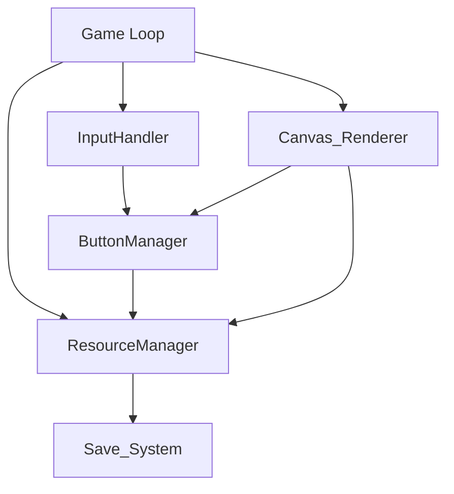

# 设计文档：关外经营系统（OutsidethePass）

## 概述

关外经营系统是玩家在城堡外进行资源生产的核心界面。本阶段实现两个基础操作按钮：炼金（产金币）和收集（产石头和木头），配合冷却机制、资源显示和自动存档功能。

技术方案遵循项目约定：单文件架构（index.html + script 标签），配置外置（外部 JS 文件），2D Canvas 渲染，localStorage 自动存档。

## 架构

### 整体结构

```
index.html          — 主文件，包含 Canvas 元素和所有核心逻辑
outside-config.js   — 关外经营系统的外置配置（冷却时间、产出数量等）
```

### 模块划分（均在 index.html 的 script 标签内）



- **Game Loop**: 游戏主循环，驱动更新和渲染
- **InputHandler**: 处理 Canvas 上的鼠标点击事件，判断点击位置
- **ButtonManager**: 管理按钮状态（可用/冷却中）、处理按钮点击逻辑
- **ResourceManager**: 管理资源数据（Gold、Stone、Wood），处理资源增减
- **Save_System**: 负责 localStorage 的读写
- **Canvas_Renderer**: 在 Canvas 上绘制按钮、资源显示、冷却倒计时

## 组件与接口

### outside-config.js（外置配置）

```javascript
// outside-config.js
var OUTSIDE_CONFIG_EXTERNAL = {
    alchemy: {
        cooldown: 5000,       // 炼金冷却时间（毫秒）
        goldAmount: 1         // 每次产生的金币数量
    },
    collect: {
        cooldown: 10000,      // 收集冷却时间（毫秒）
        stoneMin: 3,          // 石头最小产出
        stoneMax: 6,          // 石头最大产出
        woodMin: 3,           // 木头最小产出
        woodMax: 6            // 木头最大产出
    },
    canvas: {
        width: 800,
        height: 600
    }
};
```

### ResourceManager

```javascript
// 资源管理器
var ResourceManager = {
    gold: 0,
    stone: 0,
    wood: 0,

    addGold: function(amount) { /* 增加金币，触发存档 */ },
    addStone: function(amount) { /* 增加石头，触发存档 */ },
    addWood: function(amount) { /* 增加木头，触发存档 */ },
    getResources: function() { /* 返回 {gold, stone, wood} */ }
};
```

### ButtonManager

```javascript
// 按钮管理器
var ButtonManager = {
    buttons: {
        alchemy: {
            x: 0, y: 0, width: 0, height: 0,  // 位置和尺寸
            cooldownEnd: 0,                      // 冷却结束时间戳
            onClick: function() { /* 炼金逻辑 */ }
        },
        collect: {
            x: 0, y: 0, width: 0, height: 0,
            cooldownEnd: 0,
            onClick: function() { /* 收集逻辑 */ }
        }
    },

    isInCooldown: function(buttonName, now) { /* 判断是否在冷却中 */ },
    getRemainingCooldown: function(buttonName, now) { /* 获取剩余冷却秒数 */ },
    handleClick: function(x, y) { /* 判断点击了哪个按钮并执行 */ },
    isPointInButton: function(x, y, button) { /* 点击命中检测 */ }
};
```

### Save_System

```javascript
// 存档系统
var SaveSystem = {
    STORAGE_KEY: 'underground_castle_outside',

    save: function(resources) { /* JSON.stringify 写入 localStorage */ },
    load: function() { /* 从 localStorage 读取并 JSON.parse，失败返回默认值 */ }
};
```

### Canvas_Renderer

```javascript
// Canvas 渲染器
var CanvasRenderer = {
    ctx: null,  // Canvas 2D context

    init: function(canvas) { /* 初始化 context */ },
    render: function(resourceManager, buttonManager, now) { /* 主渲染方法 */ },
    drawButton: function(button, label, now) { /* 绘制单个按钮 */ },
    drawResources: function(resources) { /* 绘制资源显示 */ },
    drawCooldown: function(button, now) { /* 绘制冷却倒计时覆盖层 */ }
};
```

### InputHandler

```javascript
// 输入处理器
var InputHandler = {
    init: function(canvas, buttonManager) {
        canvas.addEventListener('click', function(e) {
            var rect = canvas.getBoundingClientRect();
            var x = e.clientX - rect.left;
            var y = e.clientY - rect.top;
            buttonManager.handleClick(x, y);
        });
    }
};
```

### Game Loop

```javascript
// 游戏主循环
function gameLoop(timestamp) {
    CanvasRenderer.render(ResourceManager, ButtonManager, timestamp);
    requestAnimationFrame(gameLoop);
}
```

## 数据模型

### 资源数据

```javascript
// 运行时资源状态
{
    gold: Number,   // 金币总量，非负整数
    stone: Number,  // 石头总量，非负整数
    wood: Number    // 木头总量，非负整数
}
```

### 按钮状态

```javascript
// 按钮运行时状态
{
    x: Number,            // 按钮左上角 X 坐标
    y: Number,            // 按钮左上角 Y 坐标
    width: Number,        // 按钮宽度
    height: Number,       // 按钮高度
    cooldownEnd: Number,  // 冷却结束的时间戳（毫秒），0 表示无冷却
    onClick: Function     // 点击回调
}
```

### localStorage 存档格式

```javascript
// localStorage 中存储的 JSON 字符串
{
    "gold": 0,
    "stone": 0,
    "wood": 0
}
```

### 随机数生成

收集按钮的资源产出使用均匀随机：

```javascript
// 生成 [min, max] 范围内的随机整数
function randomInt(min, max) {
    return Math.floor(Math.random() * (max - min + 1)) + min;
}
```


## 正确性属性（Correctness Properties）

*属性（Property）是系统在所有合法执行中都应保持为真的特征或行为——本质上是对系统应做什么的形式化陈述。属性是人类可读规格说明与机器可验证正确性保证之间的桥梁。*

以下属性基于需求文档中的验收标准，经过合并去重后得出。

### Property 1: 炼金按钮产出正确性

*For any* 资源状态和时间戳，当玩家点击 Alchemy_Button 时：若按钮不在 Cooldown 中，Gold 总量应恰好增加 1；若按钮在 Cooldown 中，Gold 总量应保持不变。

**Validates: Requirements 1.1, 1.5**

### Property 2: 收集按钮产出范围正确性

*For any* 资源状态和时间戳，当玩家点击 Collect_Button 时：若按钮不在 Cooldown 中，Stone 增量应在 [3, 6] 范围内且 Wood 增量应在 [3, 6] 范围内；若按钮在 Cooldown 中，Stone 和 Wood 总量应保持不变。

**Validates: Requirements 2.1, 2.2, 2.6**

### Property 3: 冷却时间计算正确性

*For any* 按钮和成功点击后的任意时间戳 t，若 t 在点击时刻后的配置冷却时长内，则 isInCooldown 应返回 true 且 getRemainingCooldown 应返回正确的剩余秒数（向上取整）；若 t 超过冷却时长，则 isInCooldown 应返回 false。

**Validates: Requirements 1.3, 1.4, 2.4, 2.5**

### Property 4: 资源显示一致性

*For any* 资源状态 {gold, stone, wood}，渲染输出应包含这三个资源的当前数值。

**Validates: Requirements 1.2, 2.3, 3.1, 3.2**

### Property 5: 存档读写往返一致性（Round Trip）

*For any* 合法的资源状态 {gold, stone, wood}（非负整数），执行 save 后再执行 load 应返回与原始状态等价的资源数据。

**Validates: Requirements 4.1, 4.2**

### Property 6: 点击命中检测正确性

*For any* 按钮的矩形区域 {x, y, width, height} 和任意点击坐标 (px, py)，isPointInButton 返回 true 当且仅当 px 在 [x, x+width] 范围内且 py 在 [y, y+height] 范围内。

**Validates: Requirements 5.3**

## 错误处理

### localStorage 异常

- **数据缺失**：localStorage 中无存档 key 时，Save_System.load() 返回 `{gold: 0, stone: 0, wood: 0}`
- **数据损坏**：JSON.parse 失败时，捕获异常并返回默认值 `{gold: 0, stone: 0, wood: 0}`
- **字段缺失**：解析成功但缺少某个字段时，缺失字段默认为 0
- **存储已满**：localStorage.setItem 抛出 QuotaExceededError 时，捕获异常，游戏继续运行但不保存

### Canvas 点击异常

- 点击坐标超出所有按钮区域时，不执行任何操作
- 多个按钮区域重叠时（当前设计不会出现），优先响应第一个匹配的按钮

### 资源数值边界

- 资源总量始终为非负整数
- 不设上限（后续可通过配置添加）

## 测试策略

### 属性测试（Property-Based Testing）

使用 [fast-check](https://github.com/dubzzz/fast-check) 库进行属性测试，每个属性至少运行 100 次迭代。

测试文件：`tests/outside-castle.property.test.js`

需要测试的属性：

1. **Feature: OutsidethePass, Property 1: 炼金按钮产出正确性**
   - 生成随机初始 gold 值和随机时间戳
   - 验证非冷却状态下 gold +1，冷却状态下 gold 不变

2. **Feature: OutsidethePass, Property 2: 收集按钮产出范围正确性**
   - 生成随机初始 stone/wood 值和随机时间戳
   - 验证非冷却状态下增量在 [3,6]，冷却状态下不变

3. **Feature: OutsidethePass, Property 3: 冷却时间计算正确性**
   - 生成随机点击时间和查询时间
   - 验证 isInCooldown 和 getRemainingCooldown 的返回值

4. **Feature: OutsidethePass, Property 4: 资源显示一致性**
   - 生成随机资源状态
   - 验证渲染输出包含所有资源数值

5. **Feature: OutsidethePass, Property 5: 存档读写往返一致性**
   - 生成随机合法资源状态
   - 验证 save → load 往返一致

6. **Feature: OutsidethePass, Property 6: 点击命中检测正确性**
   - 生成随机矩形和随机点击坐标
   - 验证 isPointInButton 的几何正确性

### 单元测试

测试文件：`tests/outside-castle.unit.test.js`

覆盖边界情况和具体示例：

- localStorage 数据缺失时加载返回默认值（需求 4.3 边界情况）
- localStorage 数据损坏（非法 JSON）时加载返回默认值（需求 4.3 边界情况）
- localStorage 字段缺失时缺失字段默认为 0
- 炼金按钮冷却恰好到期时可再次点击
- 收集按钮冷却恰好到期时可再次点击

### 测试框架

- 测试运行器：使用 Node.js 环境 + Jest 或 Vitest
- 属性测试库：fast-check
- 由于核心逻辑在 index.html 的 script 标签中，测试时需要将可测试的纯逻辑函数提取为可导入的模块（如 `outside-logic.js`），或在测试中直接 eval/加载脚本
- 推荐方案：将核心逻辑（ResourceManager、ButtonManager、SaveSystem、randomInt、isPointInButton）放在 `outside-logic.js` 中，index.html 通过 `<script src>` 引入，测试文件通过 `require` 导入
