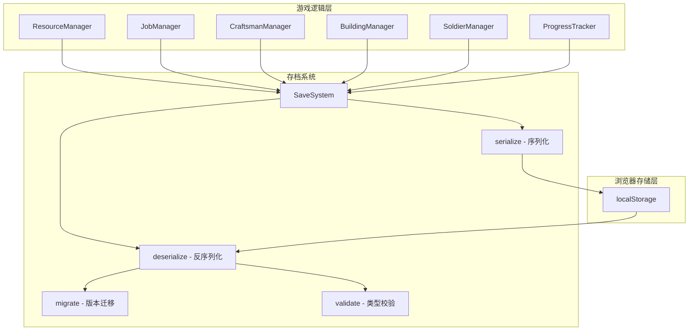

# Design Document: Local Save System

## Overview

本设计文档描述 Underground Castle 本地存档系统的统一化改造方案。当前存档能力分散在 `outside-logic.js` 的 `SaveSystem` 和 `index.html` 的扩展补丁中，存在以下问题：

1. **分散的存档逻辑**：`SaveSystem.save/load` 在 `outside-logic.js` 中处理资源/岗位/建筑/士兵，`index.html` 通过 IIFE 补丁追加 dungeon 字段，两处逻辑耦合且不易维护
2. **缺少版本管理**：无存档版本号，未来新增字段时无法自动迁移旧存档
3. **类型校验不完整**：资源字段做了 `typeof === 'number'` 检查，但 dungeon 子字段缺少校验
4. **异常处理不统一**：save 时捕获异常但 load 时部分路径未覆盖

改造目标：将所有存档逻辑统一到 `SaveSystem` 中，提供完整的 `save()`/`load()` 接口，支持版本迁移和全面的异常处理，同时保持与现有代码的兼容性。

### 设计决策

- **就地增强而非重写**：在现有 `SaveSystem` 对象上扩展，不引入新模块，保持单文件架构的简洁性
- **配置驱动**：资源字段名从 `RESOURCE_CONFIG_EXTERNAL` 读取，新增资源只需改配置
- **向前兼容**：旧存档（无版本号）视为 v1，通过迁移链逐步升级到当前版本
- **防御性反序列化**：每个字段都做类型检查，非法值回退到默认值

## Architecture

### 系统架构

存档系统作为游戏状态持久化的唯一入口，位于游戏逻辑层和浏览器存储层之间：



### 数据流

**保存流程**：
1. 游戏逻辑触发 `SaveSystem.save(resources, craftsman, jobs, buildings, soldiers)`
2. 序列化器从各 Manager 收集状态，组装为 SaveData 对象
3. 追加 `dungeon` 字段（从 `ProgressTracker.saveProgress()` 获取）
4. 写入 `version` 字段（当前版本号）
5. `JSON.stringify()` 后写入 `localStorage[STORAGE_KEY]`

**加载流程**：
1. 游戏启动调用 `SaveSystem.load()`
2. 从 `localStorage[STORAGE_KEY]` 读取 JSON 字符串
3. `JSON.parse()` 解析，失败则返回默认值
4. 检查 `version` 字段，执行版本迁移链
5. 对每个字段做类型校验，非法值回退默认值
6. 返回完整的游戏状态对象

## Components and Interfaces

### SaveSystem（增强后）

```javascript
var SaveSystem = {
    STORAGE_KEY: 'underground_castle_outside',
    CURRENT_VERSION: 2,

    /**
     * 保存所有游戏状态到 localStorage
     * @param {object} resources - ResourceManager.getResources() 返回的资源对象
     * @param {object} craftsman - { totalCapacity: number }
     * @param {object} jobs - JobManager.getAssignments() 返回的岗位分配
     * @param {object} buildings - BuildingManager.getBuildCounts() 返回的建筑数量
     * @param {Array} soldiers - SoldierManager.getSoldiers() 返回的士兵数组
     */
    save: function(resources, craftsman, jobs, buildings, soldiers) { ... },

    /**
     * 从 localStorage 加载游戏状态
     * @returns {object} 完整的游戏状态对象，包含所有字段的默认值兜底
     */
    load: function() { ... },

    /**
     * 版本迁移：将旧版存档升级到当前版本
     * @param {object} data - 解析后的存档数据
     * @returns {object} 迁移后的数据
     */
    _migrate: function(data) { ... },

    /**
     * 生成默认存档数据
     * @returns {object}
     */
    _getDefaults: function() { ... }
};
```

### 接口契约

**save() 输入**：
- `resources`: `{ gold: number, stone: number, ... }` — 17 种资源的当前数量
- `craftsman`: `{ totalCapacity: number }` — 工匠总容量
- `jobs`: `{ farmer: number, baker: number, ... }` — 各岗位分配数
- `buildings`: `{ dormitory: number, ... }` — 各建筑数量
- `soldiers`: `[{ tier, attack, defense, hp, speed }, ...]` — 士兵数组

**load() 输出**：
```javascript
{
    // 17 种资源
    gold: number, stone: number, wood: number, wheat: number,
    bread: number, leather: number, cloth: number, silk: number,
    iron: number, steel: number, crystal: number, rune: number,
    darksteel: number, gospel: number, goldOre: number,
    magicPowder: number, spiritWood: number,
    // 工匠
    craftsman: { totalCapacity: number },
    // 岗位
    jobs: { [jobId]: number },
    // 建筑
    buildings: { [buildingId]: number },
    // 士兵
    soldiers: [{ tier, attack, defense, hp, speed }],
    // 地牢进度
    dungeon: {
        unlockedLayers: number[],
        completedLayers: number[],
        layerProgress: {
            [layerId]: {
                fogState?: string[],
                bossDefeated?: boolean,
                reached?: boolean
            }
        },
        bestRecords: { [layerId]: { resourcesGained: object } },
        capturedFacilities: string[]
    } | null,
    // 版本
    version: number
}
```

### 与现有代码的集成

改造后，`index.html` 中的 SaveSystem 扩展补丁（IIFE）将被移除，dungeon 字段的保存/加载逻辑统一到 `outside-logic.js` 的 `SaveSystem` 中。`initGame()` 中的存档恢复逻辑保持不变，只是 `load()` 返回的对象现在直接包含 `dungeon` 字段。

## Data Models

### SaveData 完整结构

```javascript
{
    // 版本号（v1 无此字段，v2 开始有）
    version: 2,

    // 资源（key 由 RESOURCE_CONFIG_EXTERNAL 驱动）
    gold: 0,
    stone: 0,
    wood: 0,
    wheat: 0,
    bread: 0,
    leather: 0,
    cloth: 0,
    silk: 0,
    iron: 0,
    steel: 0,
    crystal: 0,
    rune: 0,
    darksteel: 0,
    gospel: 0,
    goldOre: 0,
    magicPowder: 0,
    spiritWood: 0,

    // 工匠
    craftsman: {
        totalCapacity: 0    // 工匠总容量（通过建造宿舍增加）
    },

    // 岗位分配
    jobs: {
        farmer: 0,          // 各岗位分配的工匠数
        baker: 0,
        // ... 其他岗位
    },

    // 建筑数量
    buildings: {
        dormitory: 0        // 各建筑已建造数量
    },

    // 士兵数组
    soldiers: [
        {
            tier: 1,         // 阶级 1-10
            attack: 60,      // 攻击力
            defense: 25,     // 防御力
            hp: 280,         // 生命值
            speed: 10        // 速度
        }
    ],

    // 地牢进度
    dungeon: {
        unlockedLayers: [1],           // 已解锁层级
        completedLayers: [],           // 已完成层级
        layerProgress: {
            // "1": { fogState: ["110...", "001..."], bossDefeated: true }
            // "5": { reached: true }  // 资源层到达记录
        },
        bestRecords: {},               // 最佳记录
        capturedFacilities: []         // 已占领设施（类型或ID字符串）
    }
}
```

### 版本迁移策略

| 版本 | 变更内容 | 迁移逻辑 |
|------|----------|----------|
| v1（无 version 字段） | 基础存档：资源、工匠、岗位、建筑、士兵 | 补全 `dungeon` 默认值，补全士兵 `speed` 字段 |
| v2（当前版本） | 统一存档：新增 `version` 和 `dungeon` 字段 | 无需迁移 |

迁移链按版本号顺序执行：`v1 → v2`。每个迁移步骤只负责从上一版本升级到下一版本，确保可组合。

### 类型校验规则

| 字段 | 期望类型 | 默认值 | 校验逻辑 |
|------|----------|--------|----------|
| 资源（gold 等） | number | `RESOURCE_CONFIG_EXTERNAL[key].initial` 或 0 | `typeof !== 'number'` 时回退 |
| craftsman.totalCapacity | number | 0 | `typeof !== 'number'` 时回退 |
| jobs[id] | number | 0 | `typeof !== 'number'` 时回退 |
| buildings[id] | number | 0 | `typeof !== 'number'` 时回退 |
| soldiers | Array | [] | 非数组时回退；每个元素需有 `tier: number` |
| soldiers[].speed | number | 10 | `typeof !== 'number'` 时回退 |
| dungeon | object | null | 非对象时回退 |
| dungeon.unlockedLayers | Array | [1] | 非数组或空数组时回退 |
| dungeon.completedLayers | Array | [] | 非数组时回退 |
| dungeon.layerProgress | object | {} | 非对象时回退 |
| dungeon.capturedFacilities | Array | [] | 非数组时回退 |
| version | number | 1 | 缺失时视为 v1 |


## Correctness Properties

*A property is a characteristic or behavior that should hold true across all valid executions of a system — essentially, a formal statement about what the system should do. Properties serve as the bridge between human-readable specifications and machine-verifiable correctness guarantees.*

### Property 1: Save/Load Round-Trip

*For any* valid game state (any combination of 17 resource quantities, craftsman capacity, job assignments, building counts, soldier array, and dungeon progress), calling `save()` followed by `load()` shall produce an object where every field is equivalent to the original input.

**Validates: Requirements 1.1, 1.2, 2.1, 2.2, 2.3, 3.1, 3.2, 3.3, 4.1, 4.2, 5.1, 5.2, 5.3, 6.1, 6.2, 7.3**

### Property 2: Missing Resource Fields Default to Config Initial

*For any* subset of resource keys removed from a valid SaveData JSON in localStorage, calling `load()` shall return the `RESOURCE_CONFIG_EXTERNAL[key].initial` value (or 0) for each missing key, while preserving all present keys' values.

**Validates: Requirements 1.3**

### Property 3: Unknown Job IDs Are Ignored

*For any* SaveData containing job assignment entries whose keys are not present in the current `JOB_CONFIG_EXTERNAL.jobs`, calling `load()` shall return a jobs object that excludes those unknown keys while preserving all valid job assignments.

**Validates: Requirements 2.4**

### Property 4: Captured Facilities Unlock Correct Jobs After Restore

*For any* set of captured facility strings (mixing facility types like `lumber_mill` and facility IDs like `layer1_lumber`), after saving and loading the dungeon progress, `ProgressTracker.getUnlockedJobs(FACILITY_CONFIG_EXTERNAL)` shall return a list that includes all jobs mapped by `facilityTypeUnlocks` for captured types, plus all jobs from `layerFacilities` entries matching captured IDs, plus all `defaultUnlockedJobs`.

**Validates: Requirements 5.4**

### Property 5: Version Migration Produces Current Version with Complete Fields

*For any* SaveData at version 1 (no `version` field, no `dungeon` field, soldiers without `speed`), calling `load()` shall return an object where: (a) `version` equals `CURRENT_VERSION`, (b) `dungeon` is either a valid progress object or null, and (c) every soldier has a numeric `speed` field.

**Validates: Requirements 8.2, 8.3, 8.4**

### Property 6: Save Always Writes Current Version

*For any* valid game state, after calling `save()`, the JSON stored in localStorage shall contain a `version` field equal to `SaveSystem.CURRENT_VERSION`.

**Validates: Requirements 8.1**

### Property 7: Corrupt Data Returns Valid Typed Defaults

*For any* string stored in localStorage under the save key (including invalid JSON, JSON with wrong types like strings where numbers are expected, or objects with missing required fields), calling `load()` shall return an object where: (a) every resource field is a number, (b) `craftsman.totalCapacity` is a number, (c) `soldiers` is an array where each element has numeric `tier`, `attack`, `defense`, `hp`, `speed`, and (d) `jobs` and `buildings` are objects with only numeric values.

**Validates: Requirements 9.2, 9.3**

### Property 8: Storage Failure Never Throws

*For any* valid game state, if `localStorage.setItem` throws an exception (e.g., QuotaExceededError) or `localStorage` is entirely unavailable, calling `save()` shall not throw. Similarly, if `localStorage.getItem` throws, calling `load()` shall not throw and shall return default values.

**Validates: Requirements 9.1, 9.4**

## Error Handling

### 保存阶段

| 异常场景 | 处理方式 |
|----------|----------|
| `localStorage.setItem` 抛出 `QuotaExceededError` | `try/catch` 静默捕获，游戏继续运行，不中断用户操作 |
| `JSON.stringify` 失败（理论上不会，因为数据都是基本类型） | `try/catch` 静默捕获 |
| `localStorage` 不可用（隐私模式、iframe 限制） | `try/catch` 静默捕获 |

### 加载阶段

| 异常场景 | 处理方式 |
|----------|----------|
| `localStorage.getItem` 返回 `null`（无存档） | 返回 `_getDefaults()` 默认值 |
| `localStorage.getItem` 抛出异常 | `try/catch` 捕获，返回默认值 |
| `JSON.parse` 失败（存档损坏） | `try/catch` 捕获，返回默认值 |
| 资源字段类型非 number | 回退到 `RESOURCE_CONFIG_EXTERNAL[key].initial` 或 0 |
| `craftsman` 非对象或 `totalCapacity` 非 number | 回退到 `{ totalCapacity: 0 }` |
| `jobs` 非对象或某个值非 number | 非对象时回退 `{}`，非 number 值设为 0 |
| `buildings` 非对象或某个值非 number | 同 jobs |
| `soldiers` 非数组 | 回退到 `[]` |
| 士兵元素缺少 `tier` 或 `tier` 非 number | 跳过该元素 |
| 士兵元素缺少 `speed` | 默认设为 10 |
| `dungeon` 非对象 | 设为 `null` |
| `dungeon.unlockedLayers` 非数组或为空 | 回退到 `[1]` |
| `dungeon.completedLayers` 非数组 | 回退到 `[]` |
| `dungeon.capturedFacilities` 非数组 | 回退到 `[]` |

### 版本迁移阶段

| 异常场景 | 处理方式 |
|----------|----------|
| `version` 字段缺失 | 视为 v1，执行 v1→v2 迁移 |
| `version` 字段非 number | 视为 v1 |
| `version` 大于 `CURRENT_VERSION` | 不做降级迁移，按原样加载（向前兼容） |

## Testing Strategy

### 测试框架

- **单元测试**：Jest（已配置在 `package.json`）
- **属性测试**：fast-check v3.15（已配置在 `package.json`）
- **测试文件**：`tests/save-system.test.js`

### 属性测试配置

- 每个属性测试最少运行 100 次迭代
- 每个测试用注释标注对应的设计文档属性编号
- 标注格式：`// Feature: local-save-system, Property N: <property_text>`

### 生成器设计

需要为属性测试构建以下 fast-check 生成器（arbitraries）：

1. **`arbResources()`**：生成 17 种资源的随机非负整数对象，key 从 `RESOURCE_CONFIG_EXTERNAL` 读取
2. **`arbCraftsman()`**：生成 `{ totalCapacity: nat }` 对象
3. **`arbJobs()`**：生成岗位分配对象，key 从 `JOB_CONFIG_EXTERNAL.jobs` 读取，值为非负整数
4. **`arbBuildings()`**：生成建筑数量对象，key 从 `JOB_CONFIG_EXTERNAL.buildings` 读取，值为非负整数
5. **`arbSoldier()`**：生成单个士兵 `{ tier: 1-10, attack: nat, defense: nat, hp: nat, speed: nat }`
6. **`arbSoldiers()`**：生成 0-20 个士兵的数组
7. **`arbDungeonProgress()`**：生成地牢进度对象，包含 unlockedLayers（含1的正整数数组）、completedLayers、layerProgress（含 fogState/bossDefeated/reached）、capturedFacilities（字符串数组）
8. **`arbSaveData()`**：组合以上所有生成器，生成完整的有效 SaveData
9. **`arbCorruptJson()`**：生成各种损坏的 JSON 字符串（非法 JSON、类型错误的字段等）

### 测试计划

**属性测试**（对应 Correctness Properties）：

| 属性 | 测试描述 | 生成器 |
|------|----------|--------|
| Property 1 | save → load round-trip 等价性 | `arbSaveData()` |
| Property 2 | 缺失资源字段回退默认值 | `arbResources()` + 随机删除 key |
| Property 3 | 未知岗位 ID 被忽略 | `arbJobs()` + 随机额外 key |
| Property 4 | 占领设施 → 解锁岗位一致性 | `arbDungeonProgress()` |
| Property 5 | v1 存档迁移后字段完整 | `arbSaveData()` 去除 version/dungeon |
| Property 6 | save 后 version 字段正确 | `arbSaveData()` |
| Property 7 | 损坏数据返回有效类型 | `arbCorruptJson()` |
| Property 8 | 存储失败不抛异常 | `arbSaveData()` + mock localStorage |

**单元测试**（边界情况和具体示例）：

- localStorage 为空时 load 返回默认值
- 空士兵数组的 save/load
- 士兵缺少 speed 字段时默认为 10
- dungeon 字段缺失时返回 null
- dungeon.unlockedLayers 为空数组时补充 [1]
- QuotaExceededError 时 save 静默处理
- 非法 JSON 字符串时 load 返回默认值
- version 字段缺失时视为 v1 并迁移

### localStorage Mock 策略

测试环境中使用简单的内存 mock 替代浏览器 localStorage：

```javascript
function createMockStorage() {
    var store = {};
    return {
        getItem: function(key) { return store[key] !== undefined ? store[key] : null; },
        setItem: function(key, value) { store[key] = String(value); },
        removeItem: function(key) { delete store[key]; },
        clear: function() { store = {}; }
    };
}
```

对于 Property 8（存储失败），mock 的 `setItem` 抛出 `DOMException` 模拟 `QuotaExceededError`。
